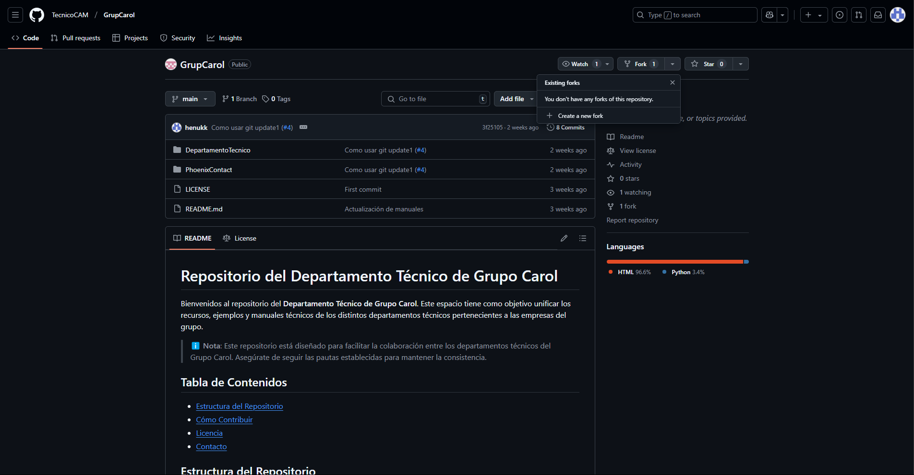
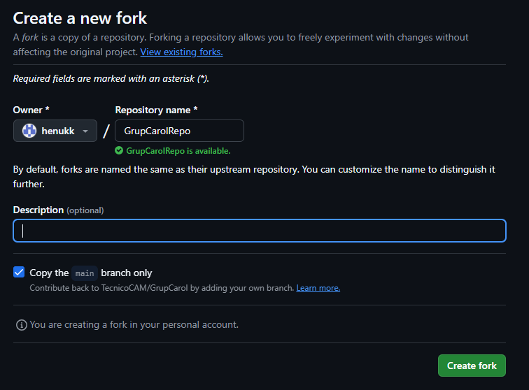
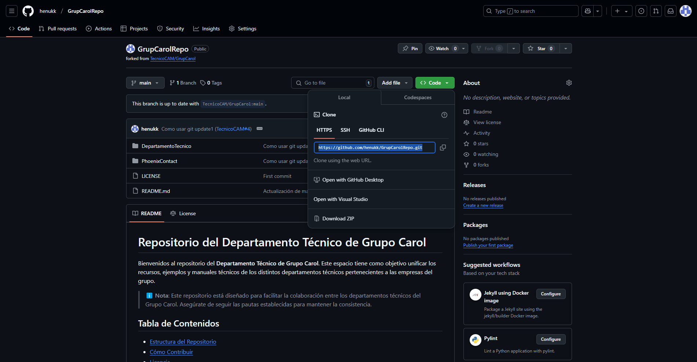
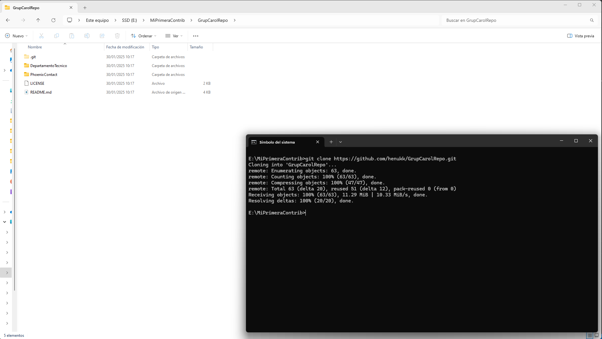
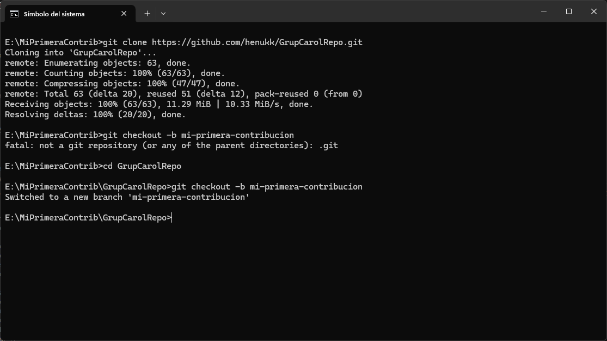
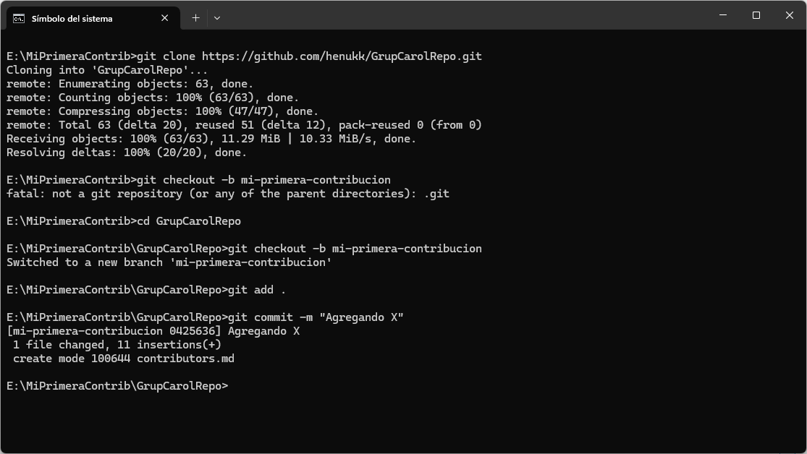
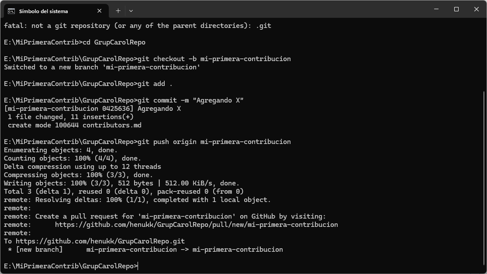
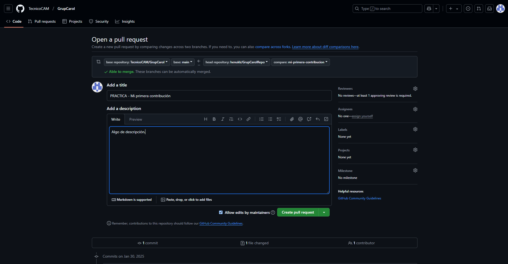
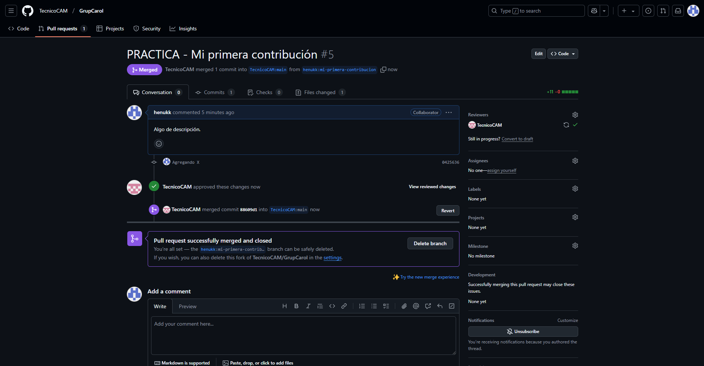

# Guía: Primera Contribución a un Repositorio Open Source

Este manual proporciona una guía detallada para realizar tu primera contribución a un proyecto en GitHub usando la terminal.

> ℹ️ **Nota**: Asegúrate de tener instalado [Git](https://git-scm.com/) y una cuenta en [GitHub](https://github.com/).

## Tabla de Contenidos
- [Hacer un Fork del Repositorio](#hacer-un-fork-del-repositorio)
- [Clonar el Repositorio](#clonar-el-repositorio)
- [Crear una Nueva Rama](#crear-una-nueva-rama)
- [Hacer Cambios y Confirmarlos](#hacer-cambios-y-confirmarlos)
- [(Practica) Agregar tu Nombre en contributors.md](#practica-agregar-tu-nombre-en-contributorsmd)
- [Subir los Cambios a GitHub](#subir-los-cambios-a-github)
- [Crear un Pull Request](#crear-un-pull-request)
- [Esperar Revisión y Fusión](#esperar-revisión-y-fusión)
- [Actualizar tu Repositorio Local](#actualizar-tu-repositorio-local)

---

## Hacer un Fork del Repositorio
1. Ve al repositorio del proyecto en GitHub.
2. Haz clic en el botón **Fork** para crear una copia en tu cuenta.




---

## Clonar el Repositorio
Ejecuta el siguiente comando en tu terminal para clonar el repositorio en tu computadora:

```bash
git clone https://github.com/TU-USUARIO/NOMBRE-DEL-REPO.git
```

Ejemplo:
```bash
git clone https://github.com/henukk/GrupCarolRepo.git
```




---

## Crear una Nueva Rama
Para mantener organizados los cambios, crea una nueva rama:

```bash
cd NOMBRE-DEL-REPO
git checkout -b mi-primera-contribucion
```



---

## Hacer Cambios y Confirmarlos
Realiza las modificaciones necesarias en los archivos (por ejemplo contributors.md) y luego guarda los cambios con:

```bash
git add .
git commit -m "Descripcion de cambios"
```



---

### (Practica) Agregar tu Nombre en contributors.md
Edita el archivo `contributors.md` para agregar tu nombre en la lista de colaboradores.

Ejemplo de contenido:
```md
# Lista de Contribuidores
- [Tu Nombre](https://github.com/TU-USUARIO)
```

Guarda los cambios y confírmalos:

```bash
git add contributors.md
git commit -m "Añadiendo mi nombre a contributors.md"
```

---

## Subir los Cambios a GitHub
Sube tu nueva rama al repositorio remoto con:

```bash
git push origin mi-primera-contribucion
```



---

## Crear un Pull Request
1. Ve a tu repositorio en GitHub.
2. Haz clic en el botón **Compare & pull request**.
3. Agrega una descripción de los cambios y envía la solicitud.




---

## Esperar Revisión y Fusión
Los mantenedores revisarán tu contribución. Si es aprobada, se fusionará en el proyecto principal. 🎉




---

## Actualizar tu Repositorio Local
Para mantener tu copia local sincronizada con el proyecto original:

```bash
git checkout main
git pull upstream main
```

---

### 🎉 Felicidades, has hecho tu primera contribución! 🚀
Si tienes dudas, consulta la documentación oficial de [GitHub](https://docs.github.com/) o la comunidad del proyecto.
